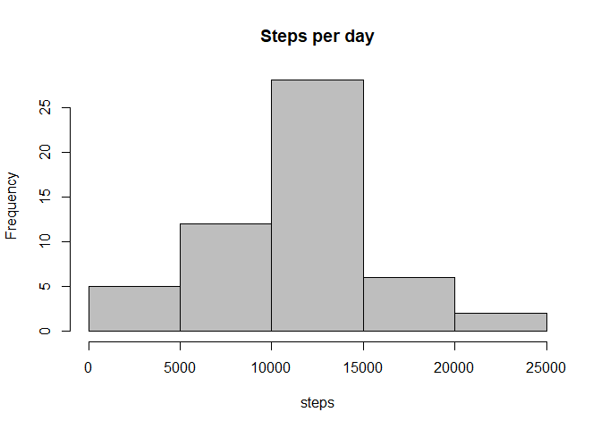
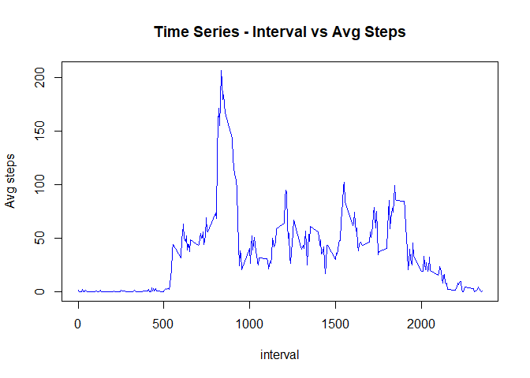
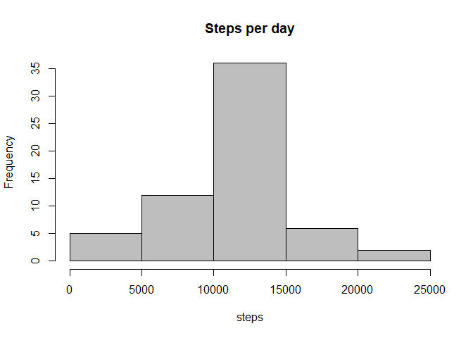
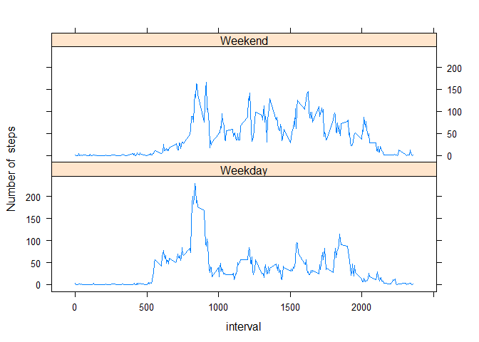

This report covers the week 2 assignment from coursera reproducible research.

This assignment makes use of data from a personal activity monitoring device. This device collects data at 5 minute intervals through out the day. The data consists of two months of data from an anonymous individual collected during the months of October and November, 2012 and include the number of steps taken in 5 minute intervals each day.

The variables included in this dataset are:

steps: Number of steps taking in a 5-minute interval (missing values are coded as NA)

date: The date on which the measurement was taken in YYYY-MM-DD format

interval: Identifier for the 5-minute interval in which measurement was taken

The dataset is stored in a comma-separated-value (CSV) file and there are a total of 17,568 observations in this dataset.


##Loading and reprocesing the data

To start, we will read the file provided "Activity monitoring Data" and save it as 'amd'. Then we are eliminating the NAs from 'amd'.


```r
library(dplyr)
```

```
## 
## Attaching package: 'dplyr'
```

```
## The following objects are masked from 'package:stats':
## 
##     filter, lag
```

```
## The following objects are masked from 'package:base':
## 
##     intersect, setdiff, setequal, union
```

```r
amd<-read.csv("./activity.csv",stringsAsFactors = FALSE)
head(amd)
```

```
##   steps       date interval
## 1    NA 2012-10-01        0
## 2    NA 2012-10-01        5
## 3    NA 2012-10-01       10
## 4    NA 2012-10-01       15
## 5    NA 2012-10-01       20
## 6    NA 2012-10-01       25
```


```r
no_na_amd<-subset(amd,amd$steps!="NA")
```

Let's take a look of the first rows of no_na_amd dataframe which does not have the NAs values,


```r
head(no_na_amd)
```

```
##     steps       date interval
## 289     0 2012-10-02        0
## 290     0 2012-10-02        5
## 291     0 2012-10-02       10
## 292     0 2012-10-02       15
## 293     0 2012-10-02       20
## 294     0 2012-10-02       25
```

##What is mean total number of steps taken per day?

For this part of the assignment, it will be ignored the missing values in the dataset.

1. Calculate the total number of steps taken per day.

The number of steps will be calcuated grouping by date and summarizing number of steps.


```r
nstep<-no_na_amd%>%group_by(date)%>%summarize(sum(steps))
colnames(nstep)[2]<-"steps"
head(nstep)
```

```
## # A tibble: 6 x 2
##         date steps
##        <chr> <int>
## 1 2012-10-02   126
## 2 2012-10-03 11352
## 3 2012-10-04 12116
## 4 2012-10-05 13294
## 5 2012-10-06 15420
## 6 2012-10-07 11015
```

2. Make a histogram of the total number of steps taken each day


```r
nstep<-as.numeric(nstep$steps)
hist(nstep,col="grey",main="Steps per day",xlab="steps")
```

<!-- -->

3. Calculate and report the mean and median of the total number of steps taken per day

Let's calculate the mean:


```r
mean1<-mean(nstep)
```

Now, let's calculate the median:


```r
median1<-median(nstep)
```

##What is the average daily activity pattern?

1. Make a time series plot (i.e. type = "l") of the 5-minute interval (x-axis) and the average number of steps taken, averaged across all days (y-axis)


```r
nstep_int<-no_na_amd%>%group_by(interval)%>%summarize(mean(steps))
colnames(nstep_int)[2]<-"steps"
plot(nstep_int$interval,nstep_int$steps,type="l",col="blue",xlab="interval",ylab="Avg steps", main="Time Series - Interval vs Avg Steps")
```

<!-- -->

2. Which 5-minute interval, on average across all the days in the dataset, contains the maximum number of steps?


```r
max_nsteps_int<-max(as.numeric(nstep_int$steps))
max_int<-subset(nstep_int,nstep_int$steps==max_nsteps_int)
head(max_int)
```

```
## # A tibble: 1 x 2
##   interval    steps
##      <int>    <dbl>
## 1      835 206.1698
```

##Imputing missing values

Note that there are a number of days/intervals where there are missing values (coded as NA). The presence of missing days may introduce bias into some calculations or summaries of the data.

1. Calculate and report the total number of missing values in the dataset (i.e. the total number of rows with NAs)


```r
num_na<-sum(is.na(amd))
num_na
```

```
## [1] 2304
```


2. Devise a strategy for filling in all of the missing values in the dataset. The strategy does not need to be sophisticated. For example, you could use the mean/median for that day, or the mean for that 5-minute interval, etc.

Let's create a Dataframe only with NA values,


```r
na_df<-subset(amd,is.na(amd$steps))
```

Now, we will convert the NA values to the mean steps based on each 5 min interval previously stored on 'nstep_int'.


```r
int_vec<-as.vector(nstep_int$interval)
steps_vec<-as.vector(nstep_int$steps)
na_df$steps[na_df$interval %in% int_vec]<-steps_vec
head(na_df)
```

```
##       steps       date interval
## 1 1.7169811 2012-10-01        0
## 2 0.3396226 2012-10-01        5
## 3 0.1320755 2012-10-01       10
## 4 0.1509434 2012-10-01       15
## 5 0.0754717 2012-10-01       20
## 6 2.0943396 2012-10-01       25
```

3. Create a new dataset that is equal to the original dataset but with the missing data filled in.

We will create a new dataset 'amd_final' using rbind to get together the dataset with no NAs 'no_na_amd' and the dataset with NAs filled in 'na_df'. This dataset will have the same data as the original one but with the NAs filled in.


```r
amd_final<-rbind(na_df,no_na_amd)
amd_final<-arrange(amd_final,date)
head(amd_final)
```

```
##       steps       date interval
## 1 1.7169811 2012-10-01        0
## 2 0.3396226 2012-10-01        5
## 3 0.1320755 2012-10-01       10
## 4 0.1509434 2012-10-01       15
## 5 0.0754717 2012-10-01       20
## 6 2.0943396 2012-10-01       25
```

4. Make a histogram of the total number of steps taken each day and Calculate and report the mean and median total number of steps taken per day. Do these values differ from the estimates from the first part of the assignment? What is the impact of imputing missing data on the estimates of the total daily number of steps?


```r
nstep_total<-amd_final%>%group_by(date)%>%summarize(sum(steps))
colnames(nstep_total)[2]<-"steps"
nstep_total2<-as.numeric(nstep_total$steps)
hist(nstep_total2,col="grey",main="Steps per day",xlab="steps")
```

<!-- -->

Let's calculate the mean:


```r
mean2<-mean(nstep_total2)
mean2
```

```
## [1] 10766.19
```

Now, let's calculate the median:


```r
median2<-median(nstep_total2)
median2
```

```
## [1] 10766.19
```

We will now calculate the difference between the mean and median,


```r
mean_diff<-mean2-mean1
mean_diff
```

```
## [1] 0
```


```r
median_diff<-median2-median1
median_diff
```

```
## [1] 1.188679
```

The impact observed on this histogram compared with the previous one with no NAs is:

* Frequency for steps from 10000 to 15000 is higher. 
* The mean is the same with or without NAs
* Mean and Median has the same value with the NAs filled in as oppossite with the first calculations that are sligthly different.


##Are there differences in activity patterns between weekdays and weekends?

For this part the weekdays() function may be of some help here. Use the dataset with the filled-in missing values for this part.

1. Create a new factor variable in the dataset with two levels - "weekday" and "weekend" indicating whether a given date is a weekday or weekend day.


Let's first set the variable date on date format using strptime function.


```r
amd_final$date<-strptime(as.character(amd_final$date),format="%Y-%m-%d",tz="")
```

Now let's create a factor variable in the database 'amd_final$week_days' containing week days. We'll also take a look of the levels.


```r
amd_final$week_days<-factor(weekdays(amd_final$date))
levels(amd_final$week_days)
```

```
## [1] "Friday"    "Monday"    "Saturday"  "Sunday"    "Thursday"  "Tuesday"  
## [7] "Wednesday"
```

We will now create new levels each week day and check the final levels.


```r
levels(amd_final$week_days)<-c(Friday="Weekday",Monday="Weekday",Saturday="Weekend",Sunday="Weekend",Thursday="Weekday",Tuesday="Weekday",Wednesday="Weekday") 
levels(amd_final$week_days)
```

```
## [1] "Weekday" "Weekend"
```

2. Make a panel plot containing a time series plot (i.e. type = "l") of the 5-minute interval (x-axis) and the average number of steps taken, averaged across all weekday days or weekend days (y-axis). See the README file in the GitHub repository to see an example of what this plot should look like using simulated data.


Plot with lattice,

```r
library(lattice)
amd_final$date<-as.character(amd_final$date)
amd_final_mean<-amd_final%>%group_by(interval,week_days)%>%summarize(mean(steps))
colnames(amd_final_mean)[3]<-"steps"
xyplot(steps~interval|as.factor(week_days),data=amd_final_mean,layout=c(1,2),type="l",ylab="Number of  steps")
```

<!-- -->

As seen on the generated plot there is a variation between 500 and 1000 interval with higher steps during weekdays than weekends. This may be related to people waking up earlier to work during weekdays. 


